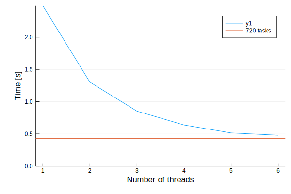

[](https://travis-ci.org/baggepinnen/ThreadTools.jl)
[](https://codecov.io/gh/baggepinnen/ThreadTools.jl)

# ThreadTools
This package implements some utilities for using threads in Julia v1.3+

The utilities provided are:

```julia
@spawnatmost n for i in ...
```
Spawn at most `n` threads to carry out for-loop

```julia
tmap(f, args...)
tmap(f, nthreads::Int, args...)
tmap1(f, args...)
tmap1(f, nthreads::Int,args...)
```
Threaded map. The optional argument `nthreads` limits the number of threads used in parallel.
`tmap1` is the same as `tmap`, but falls back to a regular `map` if julia only has access to one thread.

```julia
withlock(f, l::AbstractLock)
 ```
Executes function `f` with a call to `lock` before and `unlock` after. The lock is unlocked even if `f` throws an exception.

```julia
@withlock lock ex
```
Places calls to `lock` and `unlock` around an expression. This macro does not unlock the lock if the expression throws and exception.


The tools to limit the number of threads used are useful when doing, e.g., threaded IO, where the disk might get overloaded if you try to access it from too many threads at the same time.

# Examples
```julia
using ThreadTools

julia> l = SpinLock();
julia> times = [];
julia> @spawnatmost 3 for i = 1:10 # This will use only three parallel threads, even if more are avilable
            withlock(l) do # We protect the access to the array using a lock
                push!(times, time())
            end
            println(i)
            sleep(1)
       end

julia> round.(diff(times), digits=2)
9-element Array{Float64,1}:
    0.0
    0.0
    1.0
    0.0
    0.0
    1.0
    0.0
    0.0
    1.0

julia> tmap(_->threadid(), 1:5) # A threaded version of map
5-element Array{Int64,1}:
 2
 6
 3
 4
 5

 julia> times = tmap(_->(t=time();sleep(0.3);t), 3, 1:10); # The second argument limits the number of threads used
 julia> round.(diff(times), digits=2)
 9-element Array{Float64,1}:
  0.0
  0.0
  0.3
  0.0
  0.0
  0.3
  0.0
  0.0
  0.3

julia> a = [0];
julia> @threads for i = 1:10000 # If we protect the access to a using a lock, this works as expected
           withlock(l) do
               a[] += 1
           end
       end

julia> a[] == 10000
true

julia> a = [0];
julia> @threads for i = 1:10000 # If we do not protect access, we get a nondeterministic result
           a[] += 1
       end
julia> a[] == 10000
false

julia> a = [0];
julia> @threads for i = 1:10000
           @withlock l (a[] += 1) # The locking mechanism also comes as a macro
       end
julia> a[] == 10000
true
```

# Benchmark
All benchmarks are done on a machine with 6 physical cores. The following function will be used for benchmarking
```julia
function fib(n)
    if n <= 1 return 1 end
    return fib(n - 1) + fib(n - 2)
end
```
## Light workload
`fib(20)` 720 times
```julia
workload = fill(20, factorial(6))
times = map(1:6) do nt
    nt == 1 && return @belapsed map(fib, workload)
    @belapsed tmap(fib, $nt, workload)
end
t720 = @belapsed tmap(fib, workload)
plot(1:6, times, xlabel="Number of threads", ylabel="Time [s]")
hline!([t720], label="720 tasks", ylims=(0,Inf))

```


Conclusion: for light loads, the overhead is large. You may want to consider [KissThreading.jl](https://github.com/mohamed82008/KissThreading.jl) for a more advanced approach.

## Heavy workload
`fib(30)` 720 times
```julia
workload = fill(30, factorial(6))
times = map(1:6) do nt
    nt == 1 && return @belapsed map(fib, workload)
    @belapsed tmap(fib, $nt, workload)
end
t720 = @belapsed tmap(fib, workload)
plot(1:6, times, xlabel="Number of threads", ylabel="Time [s]")
hline!([t720], label="720 tasks", ylims=(0,Inf))

```


Conclusion: `tmap` is effective when the computational load is heavy.
